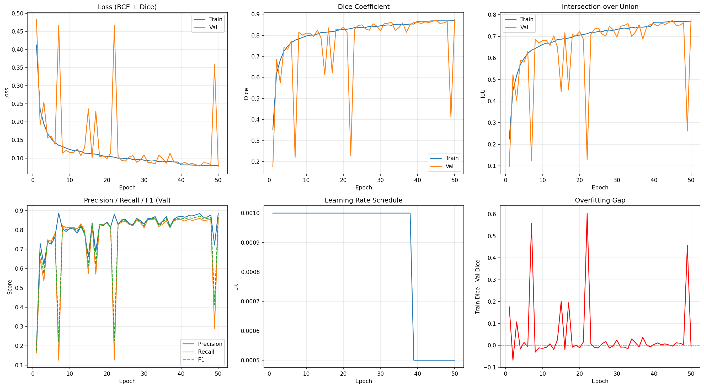
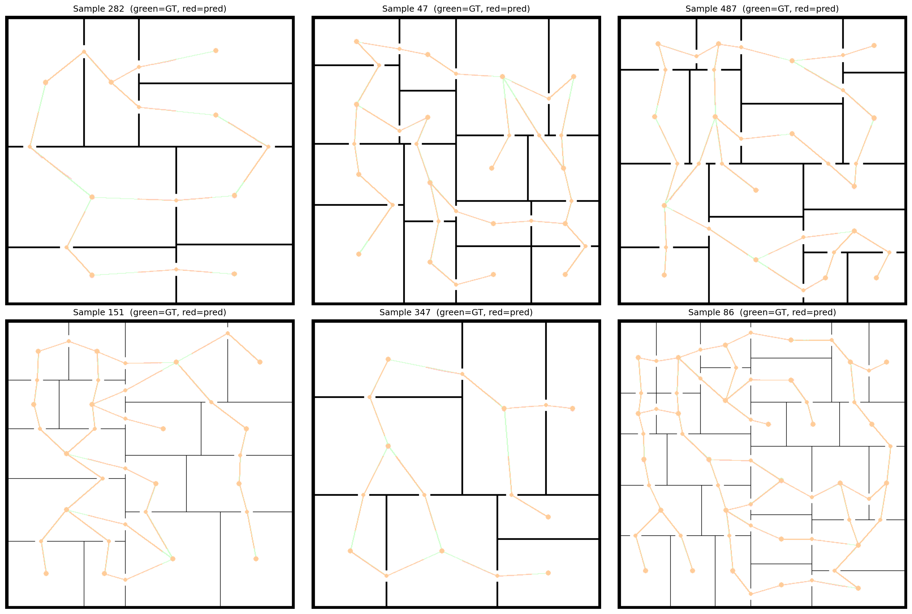

# Navigation Graph Detection from Floor Plans — Training Report

## 1. Objective

Detect navigation graphs from floor plan images using a UNet semantic segmentation model trained on synthetically generated data. The navigation graph consists of nodes (room centres and door centres) connected by edges, representing traversable paths through a building.

## 2. Data Generation

### Method

Floor plan images and corresponding navigation graph masks were generated using Binary Space Partitioning (BSP). The generator produces realistic room layouts with walls, doors, and corridors.

- **BSP Partitioning**: Recursively splits the canvas into rooms, preferring the longer axis, with 35-65% split ratios
- **Door Placement**: A BFS spanning tree guarantees all rooms are reachable; additional random doors (30% probability) create loops
- **Per-sample Randomisation**: Wall thickness, door width, BSP depth, and minimum room size are jittered per sample for variety

### Mask Definition

The navigation graph mask is a binary image containing:

| Element | Representation | Size |
|---------|---------------|------|
| Room nodes | Filled circles at room centres | Radius 8 px |
| Door nodes | Filled circles at door centres | Radius 7 px |
| Edges | Lines connecting room-door-room | Width 4 px |

### Dataset

All images are 512x512 grayscale PNGs.

| Split | Count |
|-------|-------|
| Train | 1,000 |
| Val | 200 |
| Test | 200 |
| **Total** | **1,400** |

### Augmentation (Train Only)

- Horizontal flip (50% probability)
- Vertical flip (50% probability)
- Random 90-degree rotation (0/90/180/270)

All transforms are applied identically to both image and mask.

## 3. Model Architecture

### UNet with Skip Connections

A standard UNet encoder-decoder architecture with skip connections at each level.

| Component | Details |
|-----------|---------|
| Input | 1-channel grayscale (512x512) |
| Encoder levels | 5 (64, 128, 256, 512, 1024) |
| Bottleneck | 2048 channels |
| Decoder levels | 5 (1024, 512, 256, 128, 64) |
| Downsampling | MaxPool2d (2x2) |
| Upsampling | ConvTranspose2d (2x2 stride) |
| Conv blocks | DoubleConv (Conv3x3-BN-ReLU x2) |
| Output head | Conv 1x1, sigmoid at inference |
| **Total parameters** | **~120M** |

Each encoder block's feature maps are concatenated with the corresponding decoder block via skip connections, preserving spatial detail for accurate segmentation.

### Spatial Resolution Through the Network

```
Encoder:  512 -> 256 -> 128 -> 64 -> 32 -> Bottleneck (16x16)
Decoder:  16  -> 32  -> 64  -> 128 -> 256 -> Output (512x512)
```

## 4. Training Configuration

| Parameter | Value |
|-----------|-------|
| GPU | NVIDIA RTX 4000 SFF Ada Generation (20 GB) |
| Batch size | 8 |
| Optimiser | Adam |
| Initial learning rate | 1e-3 |
| LR scheduler | ReduceLROnPlateau (factor=0.5, patience=5) |
| Loss function | DiceBCE (50% BCE + 50% Dice) |
| Early stopping patience | 10 epochs |
| Max epochs | 50 |
| Seed | 42 |
| Total training time | ~7.5 hours (26,879s) |

### Loss Function

A combined loss to handle the sparse foreground (~3-5% of pixels):

- **Binary Cross-Entropy**: Pixel-level classification loss
- **Dice Loss**: Overlap-based loss that directly optimises the Dice coefficient, reducing sensitivity to class imbalance

## 5. Training Results

### Learning Rate Schedule

The learning rate was reduced once during training:

| Epochs | Learning Rate |
|--------|--------------|
| 1-38 | 1.0e-3 |
| 39-50 | 5.0e-4 |

### Training Progression

| Epoch | Train Loss | Val Loss | Train Dice | Val Dice | Train IoU | Val IoU |
|-------|-----------|----------|------------|----------|-----------|---------|
| 1 | 0.4124 | 0.4826 | 0.3518 | 0.1760 | 0.2245 | 0.0965 |
| 10 | 0.1237 | 0.1156 | 0.7966 | 0.8100 | 0.6626 | 0.6811 |
| 20 | 0.1052 | 0.0987 | 0.8271 | 0.8381 | 0.7058 | 0.7217 |
| 30 | 0.0943 | 0.1087 | 0.8452 | 0.8209 | 0.7325 | 0.6967 |
| 40 | 0.0814 | 0.0842 | 0.8667 | 0.8622 | 0.7651 | 0.7581 |
| 50 | 0.0794 | 0.0764 | 0.8698 | 0.8748 | 0.7700 | 0.7777 |

### Training Curves



**Observations:**

- Loss decreases steadily with occasional validation spikes (epochs 7, 22, 49), likely from challenging samples in the validation set
- Dice and IoU climb consistently, with the LR reduction at epoch 39 providing a small additional boost
- The overfitting gap remains near zero throughout, indicating good generalisation
- Precision and recall are well balanced (~0.86-0.89), with no significant bias towards false positives or false negatives

## 6. Test Set Evaluation

### Metrics

| Metric | Train | Val | Test |
|--------|-------|-----|------|
| **Dice** | 0.8712 | 0.8748 | 0.8709 |
| **IoU** | 0.7722 | 0.7777 | 0.7717 |
| **Precision** | 0.8852 | 0.8866 | 0.8850 |
| **Recall** | 0.8580 | 0.8635 | 0.8576 |
| **F1** | 0.8712 | 0.8748 | 0.8709 |
| **Loss** | — | — | 0.0786 |

The test metrics are consistent with train and validation, confirming that the model generalises well to unseen floor plans.

### Visual Predictions


The model correctly identifies room centres, door centres, and connecting edges. Predictions closely match the ground truth structure.

### Overlay Predictions



Green = ground truth, Red/Orange = prediction. The high overlap between colours shows strong agreement. Minor deviations are visible at edge endpoints and in complex multi-room layouts.

## 7. Summary

- The UNet model achieves a **Dice score of 0.87** and **IoU of 0.77** on the test set
- Train-val-test metrics are closely aligned, showing no overfitting
- The model successfully learns to extract navigation graph structure (nodes and edges) from synthetic floor plans
- The combined DiceBCE loss effectively handles the sparse foreground class (~3-5% of pixels)
- The model ran for all 50 epochs without early stopping, suggesting further improvement may be possible with more epochs or a larger dataset
